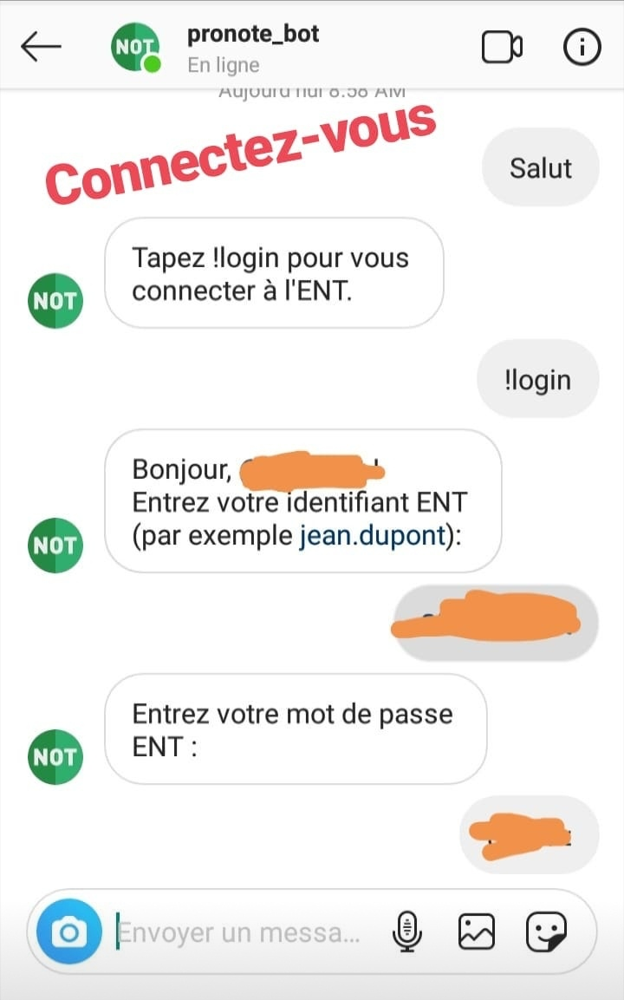
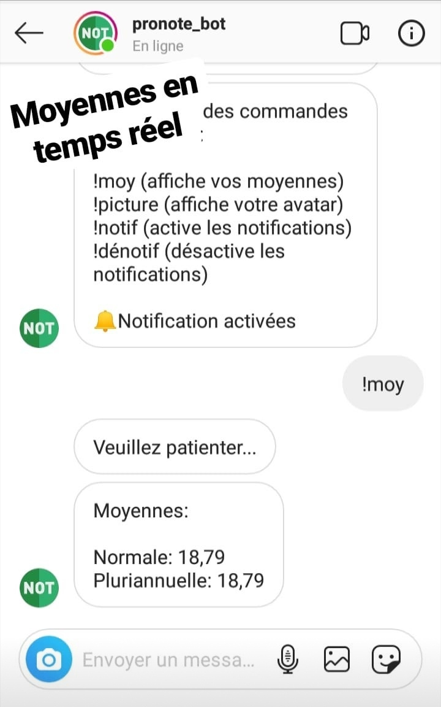
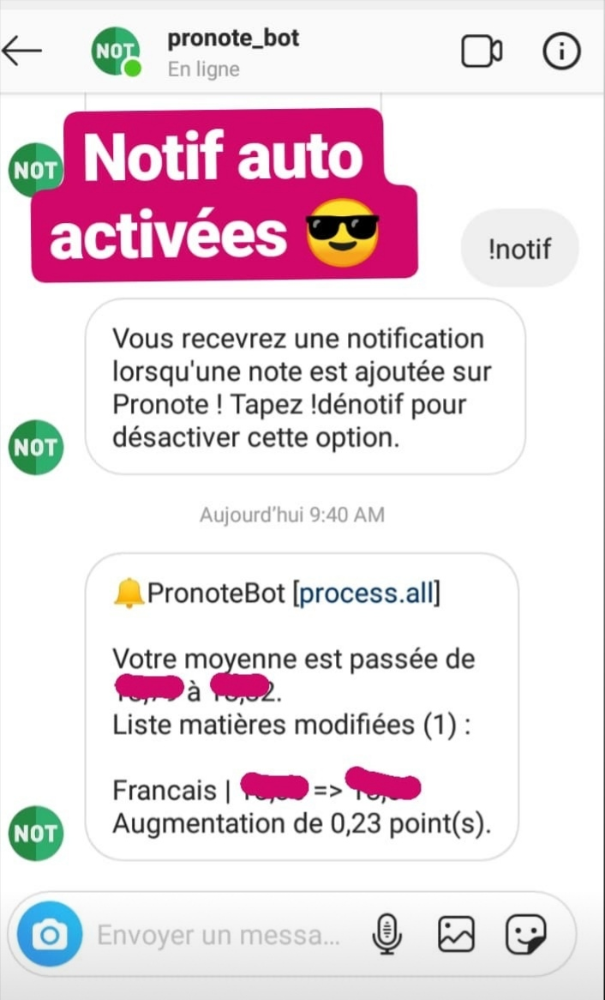

# Pronote Bot

### Vous aimerez peut-être aussi 🦄

Le pronote-bot n'est plus maintenu, il aura été un projet très intéressant, mais il demandait malheureusement trop de travail (Instagram luttant en permanence contre les bots, il fallait régulièrement faire des mises à jour pour le maintenir en ligne). Je suis heureux de vous annoncer que Pronote Notifications, une application qui vous permet de recevoir des notifications pour chaque nouvelle note et devoir vient de sortir et fais le job de pronote-bot en mieux (et en un peu plus sérieux aussi 🙃).  
[Télécharger sur Google Play](https://play.google.com/store/apps/details?id=com.androz2091.pronote_notifications&gl=FR) (*et merci à tous ceux qui nous donneront quelques étoiles! ⭐* ^^)

Chatbot Pronote disponible sur Instagram!

## Connectez-vous, affichez vos moyennes et recevez des notifs!
</img>
</img>
</img>

## 💪 Fonctionnalités

### 💬 Commandes
* Page d'aide - `!help`
* Connexion/Déconnexion - `!login`/`!logout`
* Affichage des moyennes en temps réel (moyenne normale et moyenne pluriannuelle) - `!moy`
* Envoie en tant qu'image de la photo de profil pronote - `!picture`
* Activation/Désactivation des notifications - `!notif`/`!dénotif`
* Récapitulatif de l'emploi du temps du lendemain - `!recap`

### 🔔 Notifications
Notifications lors de l'ajout d'une note, avec les fonctionnalités suivantes:
* calcul des points gagnés/perdus
* détection de la matière
* affichage de la nouvelle moyenne générale
* affichage de la nouvelle moyenne dans la matière qui a changée
* récapitulatif à 19h15 des cours annulés/ajoutés chaque jour

## 📅 To-do

* obtention de l'emploi du temps du lundi
* notification lors de la réception d'un message ENT
* autorisation automatique lors d'une demande de message privé sur Instagram

## ⚙️ Comment ça marche ?

### 🎒 Obtention des données depuis Pronote

Pronote ne disposant pas d'API permettant d'intégrer facilement certaines fonctionnalités, le @pronote_bot utilise Puppeteer, une librarie Node.js qui utilise Chromium. Pour chaque requête, le bot va ouvrir un nouveau navigateur, se rendre sur l'adresse ENT spécifiée dans la configuration et se connecter. Une fois cela fait, il va se rendre sur Pronote. La connexion ayant été réalisée sur l'ENT, Pronote va utiliser les cookies déjà présents dans le navigateur et autoriser l'accès. Des requêtes XHR vont alors être envoyées à l'API privée de Pronote, et le bot va récupérer les réponses de ces requêtes. Il va fermer le navigateur puis instancier une nouvelle classe `Student` en lui passant les données reçues par les requêtes XHR.

### 💬 Interactions avec Instagram

Toutes les requêtes envoyées vers Instagram (envoi de messages, messages marqués comme lus, abonnements automatiques, etc...) utilisent [instagram-private-api](https://github.com/dilame/instagram-private-api). Pour recevoir l'event `message`, le bot utilise [instagram_mqtt](https://github.com/Nerixyz/instagram_mqtt) (client FNBS). Cela permet de recevoir les notifications Instagram quasiment en temps réel (nouvel abonnement, nouveau message, etc...) puis de lancer des fonctions.

## ⚠️ Différents ENT

Ce bot ne fonctionne seulement que pour les ENT dont le pattern est le suivant: `votre-college.ecollege.haute-garonne.fr`. En effet, les établissements ne faisant pas partie de la Haute-Garonne ne sont pas supportés. Les lycées du département ne le sont pas non plus. Cela est du au fait que l'interface ENT n'est pas partout la même. Vous pouvez tout de même mettre vos mains dans le cambouis et aller éditer les fichiers du dossier `pronote` pour l'adapter à votre ENT.

## 📁 Installer le bot

Pour installer le bot, ouvrez le terminal et tapez les commandes suivantes :

* `git clone https://github.com/Androz2091/pronote-bot` - Téléchargement des fichiers
* `npm install -g pm2` - Installation du gestionnaire de process PM2
* `npm install --production` - Installation des dépendances du bot
* `pm2 start pronote-bot.js` - Lancement du bot

### ⛭ Fichier de configuration

Pour que le bot fonctionne correctement, vous devez remplir le fichier de configuration. Copiez le fichier `config.sample.json` en un nouveau fichier `config.json`. Puis, éditez le avec les valeurs suivantes :

`username`: Votre pseudo Instagram  
`password`: Votre mot de passe Instagram  
`entLoginURL`: L'URL de connexion à votre ENT  
`entHomePageURL`: La page d'accueil de votre ENT (sera utilisée pour vérifier que le bot n'est pas redirigé vers une page de connexion)  
`pronoteURL`: L'adresse du serveur Pronote  
`fullLog`: Le niveau de log que vous souhaitez (je vous conseille de mettre `true` dans un premier temps pour vérifier que tout fonctionne correctement)  
